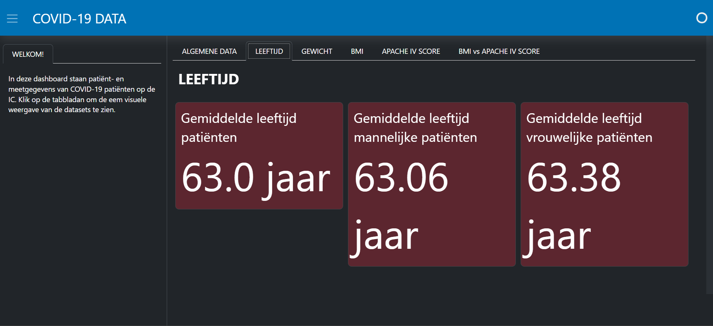
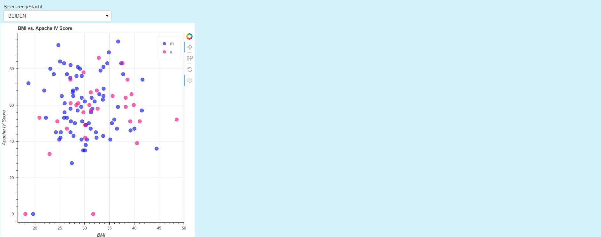
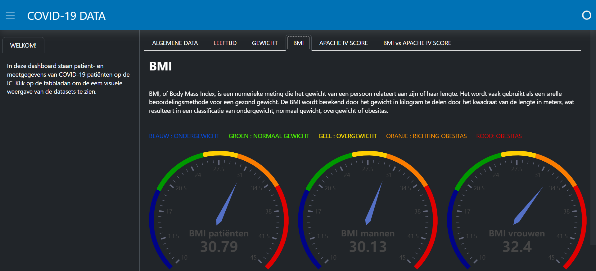
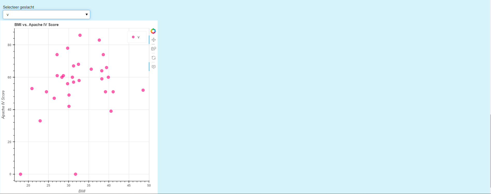

# DATADASHBOARD COVID-19 
#
#### Schrijver: Kasthury Inparajah
#### Datum: 27-01-2024

#
### Inleiding:
Dit dashboard is ontwikkeld voor de visualisatie en analyse van COVID-19 patiëntgegevens. Het biedt een overzicht van verschillende statistieken en grafieken om inzicht te krijgen van de patiënten op de Intensive Care. 
Dit dashboard bevat de gegevens van 2 datasets: covid_patienten_export.tsv & covid_meetgegevens_export.tsv. 

#
### Bestanden:
Deze repository bestaat uit:
- deze **README**
- 2 datasets: **covid_patienten_export.tsv** & **covid_meetgegevens_export.tsv**
- De applicatie (**Covid19.py**)
- EDA van de dataset (**EDA_COVID_DATA.ipynb**)
#
### Gebruik:
Clone deze repository en installeer de vereiste bibliotheken: 
- pandas 2.2.0
- numpy 1.23.5
- panel 1.3.4
- matplotlib 3.6.2
- bokeh 3.3.2
- holoviews 1.18.1

Run de applicatie, als het goed is wordt u direct naar de dashboard gebracht. 
#
### Applicatie

#
### Dashboard interactie:
Gebruik de dropdown om te schakelen tussen gegevens.
Exploreer de grafieken door te hoveren voor details en in te zoomen voor meer gedetailleerde weergaven.
De grafieken kunnen gëeploreerd worden door te hoveren op de grafieken en in- en uit- te zoomen op de grafieken. 

#
### Heeft u vragen of opmerkingen?
Dan kunt u mailen naar k.inparajah@st.hanze.nl
